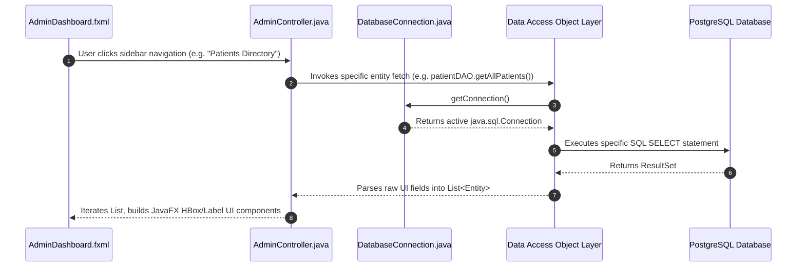

# Admin Role Workflow & Technical Details

The **Admin** role has comprehensive oversight of the Smart Hospital System. The execution of this role requires precise coordination between the visual user interface, the Java logic layer, specific database mappings, and utility files.

---

## 1. System Architecture & Data Flow

When the administrator interacts with the application, the process strictly follows the MVC (Model-View-Controller) design pattern. 

---

## 2. File Directory & Responsibility Breakdown

Below is a granular list of every file involved in the Administrator's workflow, categorized by their systemic layer.

### Frontend Layer (View)
| File | Responsibility | Core Workflow Role |
| :--- | :--- | :--- |
| `src/main/resources/views/AdminDashboard.fxml` | **User Interface Structure** | Defines the BorderPane layout. Holds the static left sidebar with `Button` triggers, and the dynamic `center` area (`VBox fx:id="contentArea"`) where JavaFX injects data. Mapped directly to `AdminController` via `fx:controller`. |
| `src/main/resources/styles/style.css` | **Styling & Aesthetics** | Controls the modern look of the app (colors, fonts, shadow effects on the `card` class, button hover states). Used to style the dynamically created data rows in the controller. |

### Business Logic Layer (Controller)
| File | Responsibility | Core Workflow Role |
| :--- | :--- | :--- |
| `src/main/java/com/hospital/controllers/AdminController.java` | **Action Orchestration** | The heart of the admin system. Intercepts UI button clicks, explicitly triggers data queries, handles potential SQL/DB failures, and dynamically generates `HBox` and `Label` combinations to physically render records on-screen. |
| `src/main/java/com/hospital/utils/Session.java` | **Authentication Tracking** | A lightweight singleton utility identifying that the logged-in user is an `Admin`. Used across the app to verify permissions. |

### Data Access Layer (Model / DAO)
| File | Responsibility | Core Workflow Role |
| :--- | :--- | :--- |
| `src/main/java/com/hospital/dao/DoctorDAO.java` | **Doctor DB Operations** | Provides `getAllDoctors()`. Executes SQL JOINs between `Users` and `DoctorDetails` tables to fetch specialization and fee. Translates SQL `ResultSet` into Java `Doctor` objects. |
| `src/main/java/com/hospital/dao/PatientDAO.java` | **Patient DB Operations** | Provides `getAllPatients()`. Executes SQL JOINs between `Users` and `PatientDetails` to fetch blood group and contact info. |
| `src/main/java/com/hospital/dao/AppointmentDAO.java` | **Appointment DB Operations** | Provides `getAllAppointments()`. Executes a complex 3-way SQL JOIN connecting `Appointments`, `Users` (for Patient Names), and `Users` (for Doctor Names). |
| `src/main/java/com/hospital/utils/DatabaseConnection.java` | **Network Bridging** | Establishes the `jdbc:postgresql` physical TCP connection to the remote Supabase PostgreSQL database using raw login credentials. |

### Entity Models
| File | Responsibility | Core Workflow Role |
| :--- | :--- | :--- |
| `src/main/java/com/hospital/models/User.java` | **Base POJO** | Abstract schema defining basic properties (`id`, `name`, `username`). |
| `src/main/java/com/hospital/models/Doctor.java` | **Extended POJO** | Subclass of `User`. Defines `specialization` and `fee`. |
| `src/main/java/com/hospital/models/Patient.java` | **Extended POJO** | Subclass of `User`. Defines `bloodGroup`, `contact`, `age`. |
| `src/main/java/com/hospital/models/Appointment.java` | **Transaction POJO** | Holds reference instances of `Patient` and `Doctor`, plus time strings. |

---

## 3. Function-by-Function Breakdown

The `AdminController.java` governs the application's responses. Here is the strict workflow of its functions:

### Utility & Setup Functions
1. **`initialize()`**
   - **Trigger:** Runs automatically by the JavaFX `FXMLLoader` the moment the Admin logs in.
   - **Work done:** Instantly triggers `showDoctors()` to ensure the dashboard immediately populates with the Doctor directory rather than displaying a blank screen.

### Core Rendering Functions
2. **`showDoctors()`**
   - **Trigger:** `@FXML` linked. Fired when clicking the "Doctors Overview" sidebar button, or during `initialize()`.
   - **Work done:** 
     1. Clears `cardArea`. 
     2. Calls `doctorDAO.getAllDoctors()`.
     3. Loops through every `Doctor` object.
     4. Wraps strings (Name, Specialization, Fee) into JavaFX `Label` objects.
     5. Packages the labels into horizontal `HBox` containers and stacks them vertically into the UI layout.

3. **`showPatients()`**
   - **Trigger:** `@FXML` linked. Fired when clicking the "Patients Directory" sidebar button.
   - **Work done:** 
     1. Overrides `headerLabel` and `subHeaderLabel` text dynamically.
     2. Clears previous UI items in `cardArea`. 
     3. Calls `patientDAO.getAllPatients()`.
     4. Constructs dynamic data rows containing Patient Name, Blood Group, Contact, and Age.

4. **`showAppointments()`**
   - **Trigger:** `@FXML` linked. Fired when clicking the "All Appointments" sidebar button.
   - **Work done:** 
     1. Clears `cardArea`. 
     2. Calls `appointmentDAO.getAllAppointments()`.
     3. Cross-references the nested `Patient` and `Doctor` objects stored inside the returned `Appointment` models to extract formatted names.
     4. Crafts a final 5-column wide table displaying the master schedule globally.

### UI Helper Functions
5. **`makeHeaderCell(String text)` / `makeDataCell(String text)`**
   - **Work done:** Applies predefined CSS classes and padding rules to plain text so they render uniformly as table cells.
6. **`makeRow(String... values)` / `makeHeaderRow(String... titles)`**
   - **Work done:** Acts as row-factories. Accepts flexible amounts of text, loops through them, converts them into `Labels`, and packages them firmly into unified `HBox` nodes with alternating border stylings.
