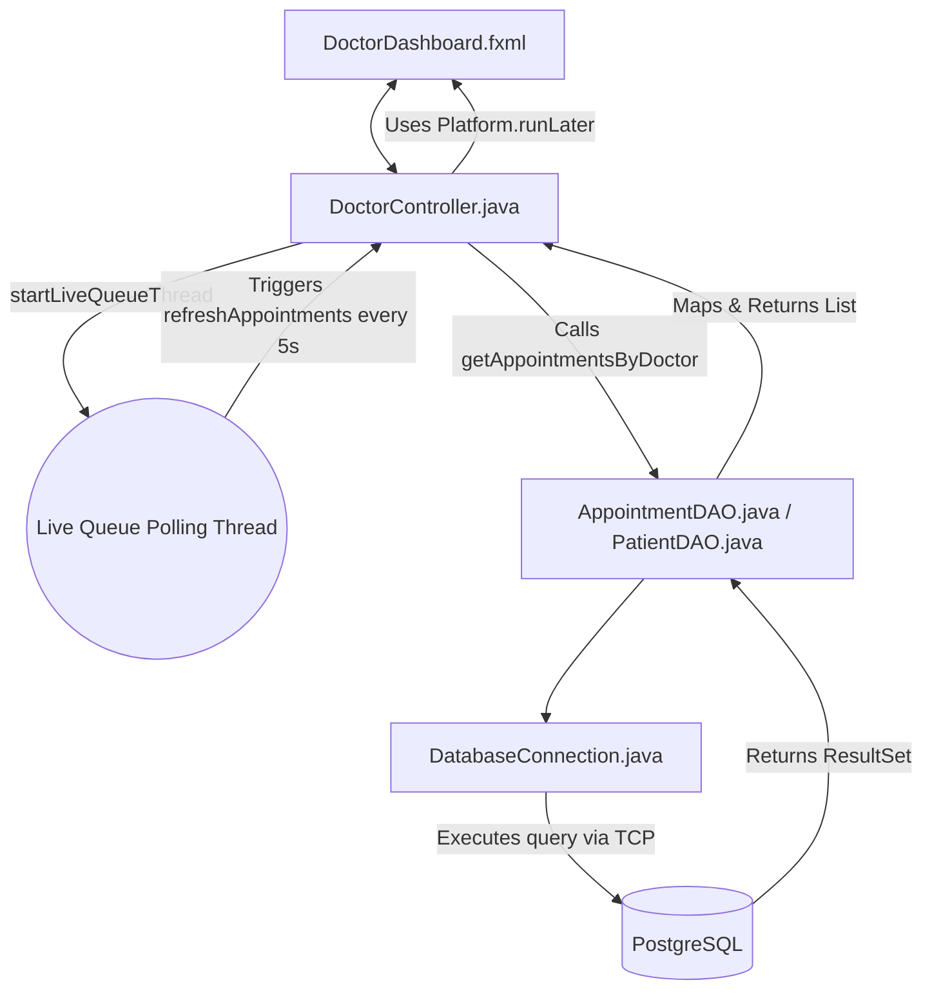

# Doctor Role Workflow & Technical Details

The **Doctor** role within the Smart Hospital System focuses strictly on managing a single physician's upcoming schedule via a live, real-time polling thread, and giving them access to the full hospital patient directory.

---

## 1. System Architecture & Data Flow

When the Doctor interacts with the application, mapping flows differently because the app relies on background thread cycles (`java.lang.Thread`) to constantly update the UI dynamically.

---

## 2. File Directory & Responsibility Breakdown

Below is a granular list of every file involved in the Doctor's workflow, categorized by their systemic layer.

### Frontend Layer (View)
| File | Responsibility | Core Workflow Role |
| :--- | :--- | :--- |
| `src/main/resources/views/DoctorDashboard.fxml` | **Main Dashboard View** | The core XML layout. Sets up the primary container (`BorderPane`) and maps buttons to logic triggers (e.g., `#showSchedule`, `#showPatients`). |
| `src/main/resources/styles/style.css` | **Visual Overrides** | Connects standardized `card`, `title-label`, and `field-label` classes to ensure everything remains professional and visually cohesive. |

### Business Logic Layer (Controller)
| File | Responsibility | Core Workflow Role |
| :--- | :--- | :--- |
| `src/main/java/com/hospital/controllers/DoctorController.java` | **Concurrency & Routing** | Acts as the engine. Hosts the `boolean isViewingSchedule` toggle. Dictates whether the screen should aggressively update from the database or sit idle while viewing patient lists. |
| `src/main/java/com/hospital/utils/Session.java` | **Security Context** | Safely stores the logged-in `User` reference. Mandatory for the Doctor to quickly pull purely *their* appointments. |

### Data Access Layer (Model / DAO)
| File | Responsibility | Core Workflow Role |
| :--- | :--- | :--- |
| `src/main/java/com/hospital/dao/AppointmentDAO.java` | **DB Appointment Querying** | Provides `getAppointmentsByDoctor(int doctorId)`. Constructs a SQL `JOIN` linking Patients to Appointments tailored to the *active* session ID. |
| `src/main/java/com/hospital/dao/PatientDAO.java` | **DB Patient Querying** | Provides `getAllPatients()`. Simply gathers the complete registry from PostgreSQL using a standard `SELECT`. |
| `src/main/java/com/hospital/utils/DatabaseConnection.java` | **DB Tunnel** | `jdbc` broker to establish the `java.sql.Connection`. |

### Entity Models
| File | Responsibility | Core Workflow Role |
| :--- | :--- | :--- |
| `src/main/java/com/hospital/models/User.java` | **Base POJO** | Base structure logic. |
| `src/main/java/com/hospital/models/Patient.java` | **Data Courier** | Carries `bloodGroup` and `contactNumber` back to the Doctor. |
| `src/main/java/com/hospital/models/Appointment.java` | **Time Container** | Stores the scheduled strings parsed exactly from DB rows. |

---

## 3. Function-by-Function Breakdown

The `DoctorController.java` is significantly more sophisticated due to its UI-multithreading.

### Initialization & Concurrency
1. **`initialize()`**
   - **Trigger:** `@FXML` activated precisely when `DoctorDashboard.fxml` loads.
   - **Work done:** Immediately launches the `startLiveQueueThread()` so the Doctor does not physically have to click anything to see their pending clients.

2. **`startLiveQueueThread()`**
   - **Trigger:** Called by `initialize()`.
   - **Work done:** Spawns a Java `Thread`. This thread sets a `while (running)` loop combined with a `Thread.sleep(5000)`. Every 5 seconds, it forces a call to `refreshAppointments()`. Set as a `Daemon` thread so Java safely kills it upon exiting the app.

3. **`stopThread()`**
   - **Trigger:** Designed for teardowns to stop memory leaks.
   - **Work done:** Flips the `running` volatile boolean to `false` and forcibly invokes `liveQueueThread.interrupt()`.

### Core Rendering Logic
4. **`refreshAppointments()`**
   - **Trigger:** Automatically invoked every 5 seconds by the Queue Thread or manually by `showSchedule()`.
   - **Work done:** 
     1. Invokes utility `getLoggedInDoctorId()` to retrieve the User's SQL ID.
     2. Calls the DB via `appointmentDAO.getAppointmentsByDoctor(docId)`.
     3. *Crucial:* Uses `Platform.runLater()` to hand the DB result safely back over to the main GUI thread, calling `renderAppointments()`. UI components cannot be edited by background threads in JavaFX.

5. **`renderAppointments(List<Appointment> apps)`**
   - **Trigger:** Safely invoked by `Platform.runLater()`.
   - **Work done:** Completely erases the `cardArea`, crafts a new `HeaderRow` combining `Patient Name`, `Time`, and `Status`, and iteratively builds out `HBox` data rows displaying up-to-the-second live data directly to the physician.

### GUI State Toggles
6. **`showSchedule()`**
   - **Trigger:** Button click on sidebar.
   - **Work done:** Toggles `isViewingSchedule = true` (allowing the thread to update the UI again), resets headers, and forces an immediate `refreshAppointments()`.

7. **`showPatients()`**
   - **Trigger:** Button click on sidebar.
   - **Work done:** Toggles `isViewingSchedule = false` (preventing the background thread from overwriting the screen). Erases the `cardArea`. Queries `patientDAO.getAllPatients()` and renders fixed records showcasing Patient Names, Contact info, and Blood types.
