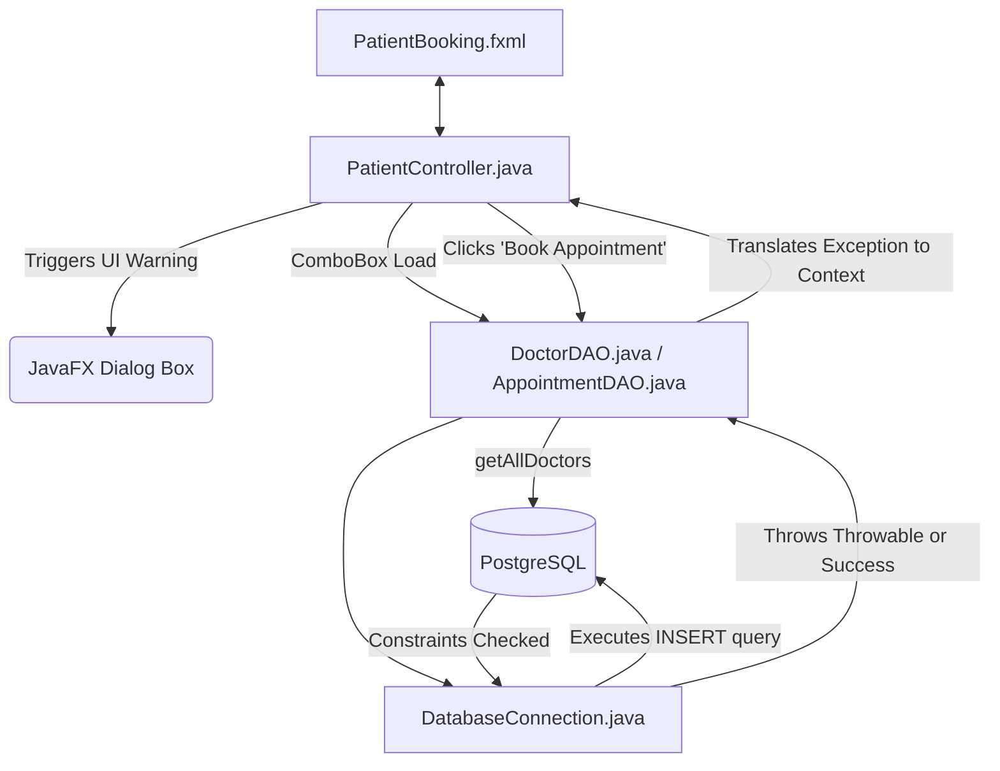

# Patient Role Workflow & Technical Details

The **Patient** role acts as the primary data-entry client in the Smart Hospital System. Patients log in strictly to securely schedule timeslots with chosen Specialists and to review their upcoming and past appointments.

---

## 1. System Architecture & Data Flow

Booking an appointment introduces logic handling for race conditions (e.g., two patients trying to book the exact same slot on a doctor). Therefore, data verification and UI alerts play a crucial role.

---

## 2. File Directory & Responsibility Breakdown

Below is a granular list of every file involved in the Patient's workflow.

### Frontend Layer (View)
| File | Responsibility | Core Workflow Role |
| :--- | :--- | :--- |
| `src/main/resources/views/PatientBooking.fxml` | **Form Input UI** | The core XML layout. Employs `ComboBox` objects for `doctorBox` and `timeSlot`, and a interactive `DatePicker` for the `datePicker` field. Linked to the UI Buttons `#bookAppointment`. |
| `src/main/resources/styles/style.css` | **Component Overrides** | Maps CSS pseudo-classes to style JavaFX Dropdowns (`.combo-box`), Calendars (`.date-picker`), and the primary Submit action `.primary-button`. |

### Business Logic Layer (Controller)
| File | Responsibility | Core Workflow Role |
| :--- | :--- | :--- |
| `src/main/java/com/hospital/controllers/PatientController.java` | **Forms & Exceptions** | Directly manipulates input validations (checking if fields are empty), explicitly catches SQL exceptions to prevent crashing, and translates backend errors to friendly UI warnings. |
| `src/main/java/com/hospital/utils/Session.java` | **Security Context** | Identifies the Patient trying to book. Protects users from mistakenly booking an appointment under someone else's ID. |

### Data Access Layer (Model / DAO)
| File | Responsibility | Core Workflow Role |
| :--- | :--- | :--- |
| `src/main/java/com/hospital/dao/DoctorDAO.java` | **Doctor Directory Querying** | Provides `getAllDoctors()`. Populates the drop-down menu so the patient can actually choose a physician to visit. |
| `src/main/java/com/hospital/dao/AppointmentDAO.java` | **DB Inserting & Querying** | Houses the `bookAppointment(Appointment)` method which performs the SQL `INSERT`. Handles returning `true/false` success flags. Provides `getAppointmentsByPatient(int id)`. |
| `src/main/java/com/hospital/utils/DatabaseConnection.java` | **DB Tunnel** | establishes the strict `jdbc` connection to process INSERTS. |

### Entity Models
| File | Responsibility | Core Workflow Role |
| :--- | :--- | :--- |
| `src/main/java/com/hospital/models/User.java` | **Base POJO** | Base structure logic. |
| `src/main/java/com/hospital/models/Doctor.java` | **ComboBox Object** | Placed physically into the `ComboBox`. Essential because we need the Doctor's `ID` but we want to display the Doctor's `Name` strings gracefully. |
| `src/main/java/com/hospital/models/Appointment.java` | **Payload** | Created instantly right before the INSERT query. Used to bundle the Patient object, Doctor object, Date String, Time String, and "Pending" default string into a unified payload. |

---

## 3. Function-by-Function Breakdown

The `PatientController.java` relies heavily on component binding and strict validation blocks.

### Bootstrapping & Load UI
1. **`initialize()`**
   - **Trigger:** `@FXML` activated precisely when `PatientBooking.fxml` loads.
   - **Work done:** 
     1. Statically fetches all visible Doctors from `doctorDAO.getAllDoctors()`.
     2. Populates `doctorBox`.
     3. Instantiates a custom JavaFX `StringConverter<Doctor>()` object so `ComboBox` items render cleanly ("Name - Specialization") instead of their raw backend hexadecimal memory addresses.
     4. Pre-fills generic half-hour strings (10:00:00, 10:30:00, etc.) into the `timeSlot` box.
     5. Forces `Platform.runLater(this::showMyAppointments)` to flip the view and display their existing appointments by default.

### Core Business Logic
2. **`bookAppointment()`**
   - **Trigger:** The patient clicks the large "Book Appointment" `#primary-button`.
   - **Work done:** 
     1. Validates all inputs: `doctorBox.getValue()`, `datePicker.getValue()`, `timeSlot.getValue()`. Aborts and triggers `Alert(WARNING)` if incomplete.
     2. Gathers the active `Session` user.
     3. Instantiates an `Appointment` Model containing all selected elements.
     4. Submits the object via `appointmentDAO.bookAppointment(app)`.
     5. Runs Try/Catch block looking for `"unique_doctor_slot"`. If caught, displays a friendly "Doctor is busy this exact minute" `Alert`.
     6. If fully successful, clears all form fields and redirects to their master timetable.

### GUI State Toggles
3. **`showBookingArea()`**
   - **Trigger:** Button click on sidebar "Book Appointment".
   - **Work done:** Replaces the text values for `headerLabel` and `subHeaderLabel`. Clears `contentArea` completely. Injects the `cardArea` VBox (which holds the standard booking input comboboxes and submit button forms) back onto the screen.

4. **`showMyAppointments()`**
   - **Trigger:** Button click on sidebar "My Appointments" or natively on `initialize()`.
   - **Work done:** 
     1. Fetches the User's SQL ID.
     2. Executes a strict DB lookup through `appointmentDAO.getAppointmentsByPatient(id)`.
     3. Clears the booking forms out of `contentArea`.
     4. Reassembles a purely visual master-table representing the individual's future and past medical bookings using dynamically created `HBox/Label` row components. 
     5. Updates the subtitle `Found X records.` string dynamically.
